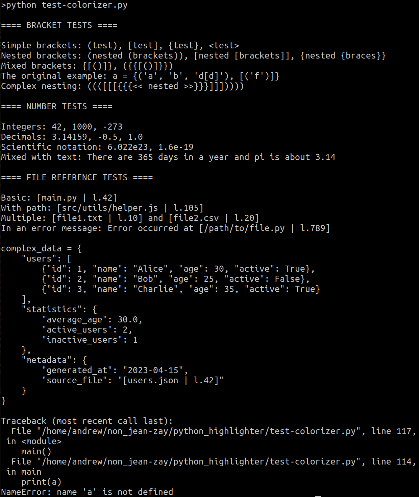
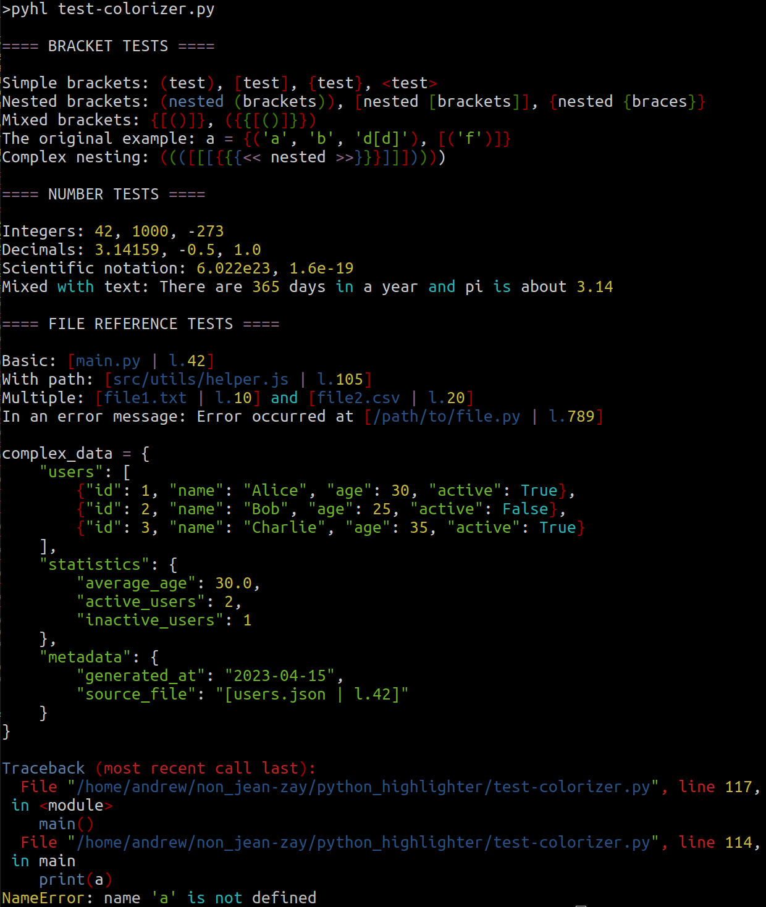

# Python Syntax Highlighter

A simple, customizable syntax highlighter for Python output in the terminal. This tool colorizes Python code and error messages to make them more readable and easier to debug.

## Features

- Syntax highlighting for Python code components:
  - Strings, numbers, operators
  - Bracket pairs with distinct colors based on nesting level
  - Python keywords, functions, classes, and modules
  - File paths and references
- Error highlighting:
  - Tracebacks with colored file references
  - Error types (like `NameError`) in bold red
  - Error messages with high visibility
- Function/class detection:
  - Function calls and definitions
  - Class definitions and references
  - Built-in functions and types
  - Common module references

### Example: Before and After Highlighting

See the difference syntax highlighting makes:

<div align="center">
  <table>
    <tr>
      <td align="center"><b>Before</b></td>
      <td align="center"><b>After</b></td>
    </tr>
    <tr>
      <td></td>
      <td></td>
    </tr>
  </table>
</div>

## Installation

1. Clone the repository:

```bash
git clone https://github.com/andrewcaunes/python_highlighter
cd python_highlighter
```

2. Make the scripts executable:

```bash
chmod +x python_highlighter.py
```

## Configuration

### Basic Configuration

1. Open your `.bashrc` file:

```bash
nano ~/.bashrc
```

2. Add the following function (make sure to update the `HIGHLIGHTER_PATH` to the actual location):

```bash
# Python with syntax highlighting
HIGHLIGHTER_PATH="$HOME/path/to/python_highlighter/python_highlighter.py"

pyhl() {
    # Check if the highlighter exists
    if [ ! -f "$HIGHLIGHTER_PATH" ]; then
        echo "Error: Highlighter not found at $HIGHLIGHTER_PATH"
        echo "Please update HIGHLIGHTER_PATH in your .bashrc"
        return 1
    fi

    # If no arguments are provided, show usage
    if [ $# -eq 0 ]; then
        echo "Usage: pyhl [-m module | script.py] [args...]"
        echo "Runs Python with syntax highlighting"
        return 0
    fi

    # Run python with highlighting
    python3 2>&1 "$@" | python3 "$HIGHLIGHTER_PATH"
}
```

3. Apply the changes:

```bash
source ~/.bashrc
```

## Usage

Once configured, you can use the `pyhl` command just like you would use `python3`:

```bash
# Run a Python script
pyhl script.py

# Run a Python module
pyhl -m module_name

# Pass arguments to your script
pyhl script.py --arg1 value1 --arg2 value2

# Use with pip output
pip install -r requirements.txt 2>&1 | python3 $HIGHLIGHTER_PATH
```

## Customization

You can customize the colors by editing the color constants at the top of the `python_highlighter.py` file:

```python
# Example: Change the string color from BRIGHT_GREEN to BRIGHT_BLUE
STRING_COLOR = Color.BRIGHT_BLUE
```

Available colors include:
- Basic: `RED`, `GREEN`, `BLUE`, `YELLOW`, `MAGENTA`, `CYAN`, `WHITE`, `BLACK`
- Bright: `BRIGHT_RED`, `BRIGHT_GREEN`, `BRIGHT_BLUE`, etc.
- Formatting: `BOLD`, `UNDERLINE`

You can also combine colors with formatting using string concatenation:
```python
ERROR_NAME_COLOR = f"{Color.BRIGHT_RED}{Color.BOLD}"
```

## Troubleshooting

**Problem**: No colors in the output
- Make sure your terminal supports ANSI color codes
- Try using `echo -e "\033[31mThis should be red\033[0m"` to test

**Problem**: Missing highlighting for some elements
- You may have found a pattern not covered by the highlighter
- Consider adding it to the appropriate detection function and submit a pull request!

